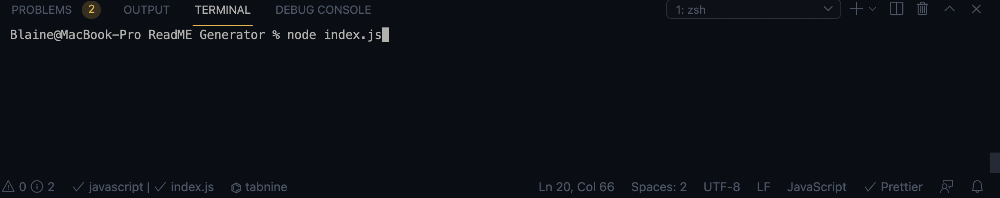

# ReadMe-Generator

## Description 

Your GitHub profile is an extremely important aspect of your public identity as a developer. A well-crafted one allows you to show off your work to other developers as well as potential employers. An important component of your GitHub profile—and one that many new developers often overlook—is the README.md file.

The quality of a README often differentiates a good project from a bad project. A good one takes advantage of the opportunity to explain and showcase what your application does, justify the technologies used, and even talk about some of the challenges you faced and features you hope to implement in the future. A good README helps you stand out among the large crowd of developers putting their work on GitHub.

There's no one right way to structure a good README. There is one very wrong way, however, and that is to not include a README at all or to create a very anemic one. This guide outlines a few best practices. As you progress in your career, you will develop your own ideas about what makes a good README.

## Installation

npm init

npm inquirer

## Usage 

You can run my app by typing node index.js in the terminal while being in your root directory

## Credits
https://github.com/mariamv29

## Contributing

https://github.com/blainecurren
